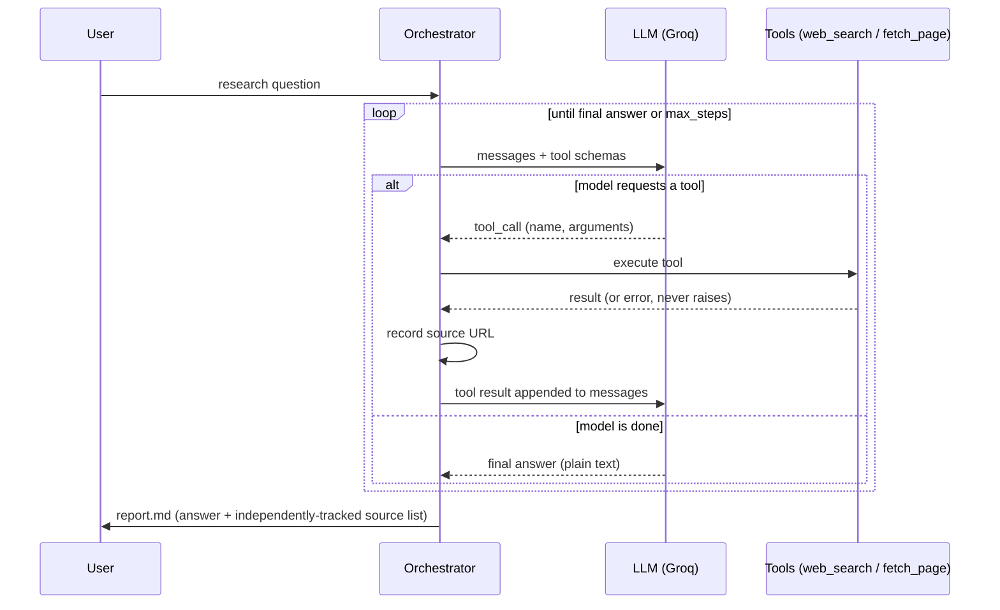

# Agentic Research Assistant

A small, hand-rolled agent that takes a research question, autonomously
decides what to search for, reads the pages it finds, and writes a cited
report — without any prewritten script telling it which sources to use.
It's built directly on the tool-calling API (Groq's free OpenAI-compatible
endpoint) rather than a framework like LangChain/LangGraph/CrewAI, so every
part of the control loop — how a tool call is dispatched, how sources are
tracked, how the loop decides it's done — is plain, readable Python.

## Why this project

Agentic AI — models that plan, call tools, and iterate rather than answer
in one shot — is the GenAI pattern most in demand in 2026 hiring. Building
the loop by hand (instead of only wiring up a framework) demonstrates
understanding of what frameworks like LangGraph actually do under the hood.

## How it works



Two design choices worth calling out:

- **The reference list is built from what tools were actually called**, not
  from what the model claims it cited (`agent/report.py::SourceStore`).
  Models sometimes forget to cite a source they used — the report's
  "Sources" section is grounded in the tool-call trace, not the model's memory.
- **Tools never raise.** A bad URL or a search timeout becomes an
  `{"error": ...}` observation the model can react to (e.g. try a different
  query), instead of crashing the whole research run.
- **A step budget with forced termination** (`MAX_STEPS`): if the model
  keeps calling tools without converging, the loop cuts it off and forces
  one final synthesis call from whatever evidence exists so far — an agent
  without a hard stop condition is a liability, not just an inconvenience.

## Setup

```bash
python -m venv .venv && source .venv/bin/activate
pip install -r requirements.txt

cp .env.example .env
# then put a free key from https://console.groq.com into .env as GROQ_API_KEY
```

## Run it

CLI:

```bash
python -m agent.cli research "What are the main approaches to LLM agent evaluation in 2026?"
```

Streamlit UI:

```bash
streamlit run streamlit_app.py
```

Docker (runs the Streamlit UI; pass your key at runtime, never bake it into the image):

```bash
docker build -t agentic-research-assistant .
docker run -p 8501:8501 -e GROQ_API_KEY=your_key_here agentic-research-assistant
```

## Tests

```bash
pytest -v
```

13 tests, none requiring a real API key or network access: the LLM client
is swapped for a scripted fake (`tests/test_orchestrator.py`) that exercises
tool-call dispatch, source tracking, unknown-tool handling, and the
forced-termination path; `web_search`/`fetch_page` are tested against
mocked DuckDuckGo/trafilatura responses (`tests/test_tools.py`); citation
formatting is tested directly (`tests/test_report.py`). CI runs the full
suite plus a `docker build` on every push.

## Project layout

```
agent/config.py        env-driven settings (model name, step budget)
agent/tools.py         web_search (DuckDuckGo, no key needed) + fetch_page (trafilatura)
agent/llm_client.py    thin Groq wrapper behind a swappable interface
agent/orchestrator.py  the agent loop itself
agent/report.py        source tracking + markdown report assembly
agent/cli.py           Typer CLI entry point
streamlit_app.py        interactive UI
tests/                  fully mocked test suite (no API key needed)
```

## Stack

Python, Groq API (Llama 3.3), DuckDuckGo Search, trafilatura, Typer, Streamlit, pytest, Docker, GitHub Actions.
